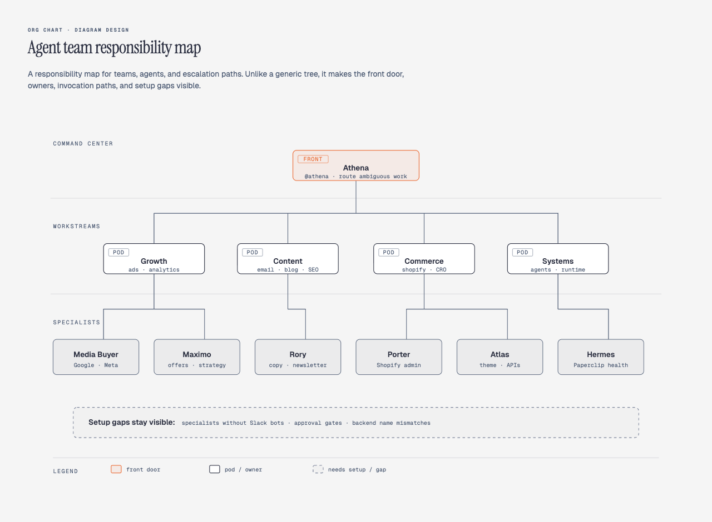

# Diagram Design

**Editorial diagrams your designer won't hate.**


14 types. One Claude Code skill. Your brand in 60 seconds — the skill reads your website and maps colors + fonts to every diagram.

No Figma. No generic rounded boxes. No 30-minute color-picking sessions.

---

## Why I built it

I write at [littlemight.com](https://littlemight.com?utm_source=diagram-design&utm_medium=readme&utm_campaign=github&utm_content=intro) (and run [BestSelf.co](https://bestself.co?utm_source=diagram-design&utm_medium=readme&utm_campaign=github&utm_content=intro) on the side). Every time I needed a diagram — an architecture sketch, a flowchart, a pyramid of what matters most — I'd ask Claude and get back a generic rounded-box thing that looked nothing like the rest of the site. I'd either fight with Figma for 30 minutes or just skip the diagram.

So I built a Claude Code skill for it. Fourteen types, editorial quality, matches your brand in 60 seconds by reading your website.

> *The highest-quality move is usually deletion.* Every node earns its place. The accent color is reserved for the 1–2 things the reader should look at first. Target density: 4/10.

---

## What it makes

All 14 diagrams ship in three variants: minimal light, minimal dark, and full-editorial. Open any of them directly in a browser — no build step, no JS, no external images.

<table>
<tr>
  <td align="center" width="33%"><br><b>Architecture</b><br><sub>Components + connections</sub></td>
  <td align="center" width="33%"><br><b>Flowchart</b><br><sub>Decision logic</sub></td>
  <td align="center" width="33%"><br><b>Sequence</b><br><sub>Messages over time</sub></td>
</tr>
<tr>
  <td align="center"><br><b>State machine</b><br><sub>States + transitions</sub></td>
  <td align="center"><br><b>ER / data model</b><br><sub>Entities + fields</sub></td>
  <td align="center"><br><b>Timeline</b><br><sub>Events on an axis</sub></td>
</tr>
<tr>
  <td align="center"><br><b>Swimlane</b><br><sub>Cross-functional flow</sub></td>
  <td align="center"><br><b>Quadrant</b><br><sub>Two-axis positioning</sub></td>
  <td align="center"><br><b>Nested</b><br><sub>Hierarchy by containment</sub></td>
</tr>
<tr>
  <td align="center"><br><b>Tree</b><br><sub>Parent → children</sub></td>
  <td align="center"><br><b>Org chart</b><br><sub>Ownership + routing</sub></td>
  <td align="center"><br><b>Venn</b><br><sub>Set overlap</sub></td>
</tr>
<tr>
  <td align="center"><br><b>Layer stack</b><br><sub>Stacked abstractions</sub></td>
  <td align="center"><br><b>Pyramid / funnel</b><br><sub>Ranked hierarchy or drop-off</sub></td>
  <td align="center">&nbsp;</td>
</tr>
<tr>
  <td align="center"><br><b>Consultant 2×2</b><br><sub>Scenario matrix · named cells</sub></td>
  <td align="center">&nbsp;</td>
  <td align="center">&nbsp;</td>
</tr>
</table>

**Browse the live gallery:** open [`skills/diagram-design/assets/index.html`](skills/diagram-design/assets/index.html) in your browser to flip through all 14 diagrams with light / dark / full-editorial tabs.

---

## Install

```bash
# Clone the repo somewhere, then symlink the inner skill into Claude Code's skills dir
git clone git@github.com:cathrynlavery/diagram-design.git ~/code/diagram-design
ln -s ~/code/diagram-design/skills/diagram-design ~/.claude/skills/diagram-design
```

The real skill lives at `skills/diagram-design/` inside the repo (so the same tree works as a Claude Code plugin, a Codex plugin, and a standalone skill). The symlink points Claude Code at that inner directory.

Restart Claude Code. The skill registers as `diagram-design` and activates whenever you ask Claude to make a diagram.

### Alternative: install as a plugin

Quicker to install — but the skill lives in the plugin cache, so edits to `references/style-guide.md` don't survive plugin updates. Pick this if you just want to try it out; use the clone route above if you plan to customize the style guide by hand.

**Claude Code:**
```
/plugin marketplace add cathrynlavery/diagram-design
/plugin install diagram-design@diagram-design
```

**Claude Cowork:** Customize → Directory → Plugins → **+** → paste `cathrynlavery/diagram-design` → Sync, then install from the Personal list.

**Codex:**
```
npx skills add https://github.com/cathrynlavery/diagram-design --skill diagram-design
```

---

## Onboarding — make it look like *your* brand

The whole point: ship editorial-quality diagrams in **your** colors and typography, not a generic template.

Out of the box, diagrams render in a clean **jet-black + atomic-tangerine** palette (white-smoke paper, jet-black ink, atomic-tangerine accent, blue-slate muted, silver hairlines). Good enough to screenshot straight away. But 60 seconds of onboarding is better — the skill will pull your brand from your website and apply it across every diagram.

### The flow

```
You:     "onboard diagram-design to https://yoursite.com"
Claude:  → fetches the homepage
         → extracts the dominant palette + font stack
         → maps detected values to semantic roles:
             paper, ink, muted, accent, link
         → shows a proposed diff
         → writes your tokens to references/style-guide.md
You:     "yes, apply it"
```

Every new diagram now uses your colors. Your website's paper color becomes the diagram background. Your CTA color becomes the focal accent. Your body font stack becomes the node label family.

### What gets extracted

| Detected from your site | Becomes |
|---|---|
| `<body>` background | `paper` token |
| Primary text color | `ink` token |
| Secondary / caption text | `muted` token |
| Cards or containers | `paper-2` token |
| Most-used brand color (CTA, link, heading) | `accent` token |
| `<h1>` font family | `title` font |
| `<body>` font family | `node-name` font |
| `<code>` / `<pre>` font | `sublabel` font |

### Contrast checks happen automatically

Before writing tokens, the skill verifies WCAG AA contrast on `ink` over `paper`. If your site has a color that fails contrast at diagram sizes (9–12px), it proposes an adjusted value and explains why.

### Manual override

Prefer to set tokens by hand? Open [`skills/diagram-design/references/style-guide.md`](skills/diagram-design/references/style-guide.md) and edit the table. Everything downstream reads from there — all 14 diagrams, the annotation primitive, and the gallery all inherit semantic role names (`accent`, not `#eb6c36`).

### First-run gate

The skill won't silently ship default-skinned diagrams into a branded project. On first use in a new project, it checks if `style-guide.md` has been customized. If not, it pauses and asks:

> *"This is your first diagram in this project. The style guide is still at the default. Want to run onboarding, paste tokens manually, or proceed with default?"*

See [`skills/diagram-design/references/onboarding.md`](skills/diagram-design/references/onboarding.md) for the full spec.

---

## Quickstart

```bash
# Open the gallery to see all 14 diagrams
open ~/.claude/skills/diagram-design/assets/index.html

# In Claude Code, just ask:
# "Make me an architecture diagram of my app: frontend, backend, database, Redis cache."
# "I need a quadrant showing Q2 projects by impact vs effort."
# "Give me a sequence diagram of the OAuth handshake."
```

Claude will pick the right type, build the HTML, and save it. You can also start from a template directly:

```bash
cp assets/template.html my-diagram.html        # minimal light
cp assets/template-full.html my-diagram.html   # editorial with summary cards
```

---

## Architecture

Progressive disclosure. `SKILL.md` is a lean index — it tells Claude how to pick a type and where to look for detail. Every type lives in its own reference file, loaded only when relevant.

```
diagram-design/
├── SKILL.md                         — top-level: philosophy, selection guide, checklist
├── references/                      — loaded only when a type or primitive is chosen
│   ├── style-guide.md               — single source of truth for colors + fonts
│   ├── onboarding.md                — the URL-to-tokens flow
│   ├── type-architecture.md
│   ├── type-flowchart.md
│   ├── type-sequence.md
│   ├── type-state.md
│   ├── type-er.md
│   ├── type-timeline.md
│   ├── type-swimlane.md
│   ├── type-quadrant.md
│   ├── type-nested.md
│   ├── type-tree.md
│   ├── type-org-chart.md
│   ├── type-layers.md
│   ├── type-venn.md
│   ├── type-pyramid.md
│   ├── primitive-annotation.md      — italic-serif editorial callouts
│   └── primitive-sketchy.md         — hand-drawn SVG filter variant
├── assets/
│   ├── index.html                   — live gallery, tabbed
│   ├── template*.html               — scaffolds for new diagrams
│   ├── example-<type>.html          — 3 variants × 14 types
│   └── example-quadrant-consultant.html  — consultant-special 2×2 scenario matrix
└── docs/screenshots/                — the images in this README
```

This keeps Claude's working context tight (only load what you need) and makes the skill easy to extend — drop a new `type-<name>.md` and wire it into the selection guide.

### What loads when

The top-level `SKILL.md` is always in context. Everything else is pulled in only when relevant — this is what keeps the skill fast even with 15 reference files.

| You ask for… | Claude loads |
|---|---|
| "Make me a flowchart" | `SKILL.md` + `references/type-flowchart.md` |
| "Build an architecture diagram" | `SKILL.md` + `references/type-architecture.md` |
| "Onboard this skill to my site" | `SKILL.md` + `references/onboarding.md` + `references/style-guide.md` |
| "Add an editorial callout to this diagram" | `SKILL.md` + `references/primitive-annotation.md` |
| "Give me a hand-drawn version" | `SKILL.md` + `references/primitive-sketchy.md` |
| Routine diagram-making (any of the 14 diagrams) | Only `SKILL.md` + that one type's reference |

No matter how many types exist, Claude only reads the one you need. Add a new type tomorrow and nothing else changes.

---

## The design system (in one paragraph)

One accent color, 1–2 focal elements per diagram. Three font families: Instrument Serif (title + italic callouts), Geist sans (node names), Geist Mono (technical sublabels). 1px hairline borders, no shadows, max border-radius 10px. Every coord, width, and gap divisible by 4 — non-negotiable, it's what keeps the diagrams from feeling AI-generated. Mono is for technical content (ports, URLs, field types), not a blanket "dev" aesthetic. Coral-tinted focal nodes draw the eye to the 1–2 things that matter. Full spec in [`SKILL.md`](skills/diagram-design/SKILL.md#5-design-system).

---

## Primitives

- **Annotation callout** — italic Instrument Serif + dashed Bézier leader, for editorial asides that sit in the margins. See [`skills/diagram-design/references/primitive-annotation.md`](skills/diagram-design/references/primitive-annotation.md).
- **Sketchy filter** — SVG turbulence + displacement map for a hand-drawn variant. Good for essays, not for technical docs. See [`skills/diagram-design/references/primitive-sketchy.md`](skills/diagram-design/references/primitive-sketchy.md).

---

## When *not* to use this skill

- **Quick unicode diagrams** for tweets or terminal output → wiretext-style skill.
- **Lists of anything** → a table or bullets.
- **Before/after comparisons** → a table.
- **One-shape "diagrams"** — a single box with a label → just write the sentence.

Before drawing, ask: *would a reader learn more from this than from a well-written paragraph?* If no, don't draw.

---

## About

Made by **Cathryn Lavery** — founder of [BestSelf.co](https://bestself.co?utm_source=diagram-design&utm_medium=readme&utm_campaign=github&utm_content=bio). I write about AI, entrepreneurship, and designing nice-looking things at [littlemight.com](https://littlemight.com?utm_source=diagram-design&utm_medium=readme&utm_campaign=github&utm_content=bio) — blog + newsletter.

If this is useful, **star the repo** and come [say hi on X](https://x.com/cathrynlavery).
